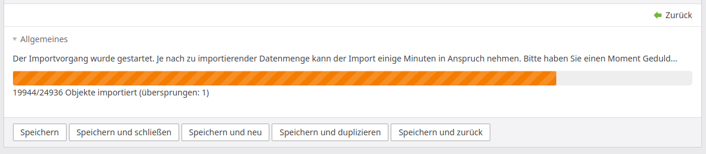

# Contao Progress Bar Widget Bundle

This bundle offers a dynamic progress bar widget for the Contao CMS.

## Features

- adds a progress bar widget (currently for the backend only) **for a given database record**
- ajax support (self-auto-updating)
- also display the progress in numbers

## Impressions



The progress bar widget included in an example data container array

## Installation

1. Install via composer: `composer require heimrichhannot/contao-progress-bar-widget-bundle`.

## Usage

1. Create the field in the desired data container array (DCA) as usual:
    ```php
    'importProgress'                 => [
        'inputType' => 'huhProgressBar',
        'eval' => [
            // an introduction text for the widget (mandatory)
            'description' => $GLOBALS['TL_LANG']['tl_entity_import_config']['reference']['importProgressDescription'],
            // only show the progress bar but not the numbers below (optional, default false)
            'hideNumbers' => false,
            // hide skipped items from the numbers section (optional, default false)
            'hideSkippedItems' => false
        ]
    ],
    ```
2. The progress is passed via an event listener for the event `LoadProgressEvent`. Register an event listener (or subscriber) as usual in symfony:
   ```php
   use HeimrichHannot\ProgressBarWidgetBundle\Event\LoadProgressEvent;
   use HeimrichHannot\ProgressBarWidgetBundle\Widget\ProgressBar;
   use Terminal42\ServiceAnnotationBundle\Annotation\ServiceTag;

   /**
    * @ServiceTag("kernel.event_listener", event="huh.progress_bar_widget.event.load_progress")
    */
   class LoadProgressListener
   {
       public function __invoke(LoadProgressEvent $event) {
           if (null === ($record = MyModel::findByPk($event->getId()))) {
               return;
           }

           // map the record's state field to the progress bar's expectations
           // of course you can decide yourself in which cases you'd like to pass which state
           switch ($record->state) {
               case 'success':
                   $state = ProgressBar::STATE_SUCCESS;
                   break;
               case 'error':
                   $state = ProgressBar::STATE_FAILED;
                   break;
               default:
                   $state = ProgressBar::STATE_IN_PROGRESS;
           }

           $event->setData([
               'state'           => $state,
               'currentProgress' => $record->importProgressCurrent, // field name depends on your dca
               'totalCount'      => $record->importProgressTotal, // field name depends on your dca
               'skippedCount'    => $record->importProgressSkipped // field name depends on your dca
           ]);
       }
   }
   ```

## Events
